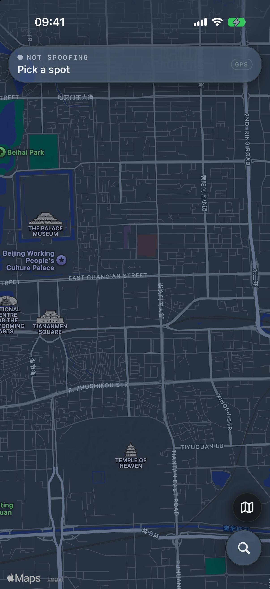
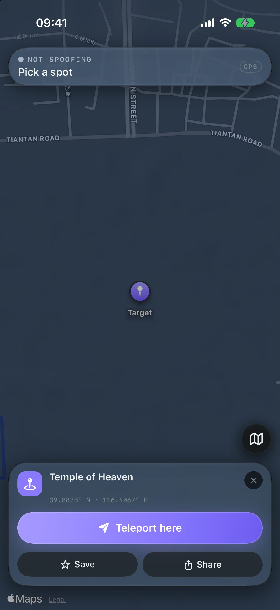
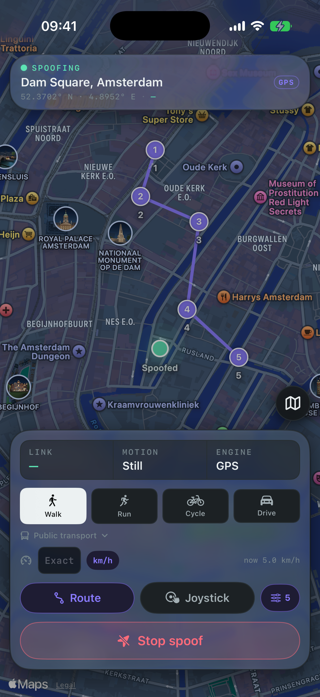
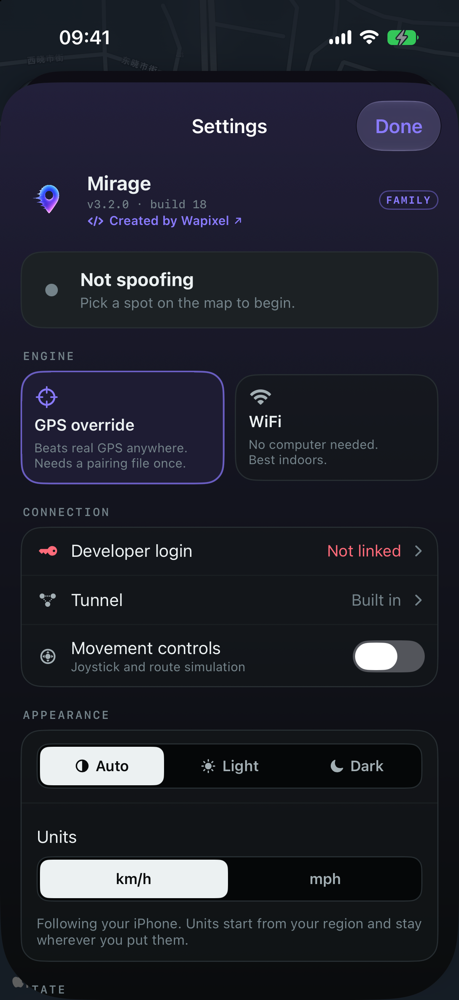

<!-- ░░░ Mirage ░░░ -->

 

iOS 18 → 27 · tested on iOS 27 & iPhone 17 Pro · made by Wapixel

---

## ✦ What is Mirage?

Mirage makes your iPhone believe it's somewhere else. Drop a pin anywhere on the
map, tap **Teleport**, and every app reads that location — not a fake wrapper,
the real system location. Walk around with a joystick, follow a route you draw,
or import a GPX track and let Mirage travel it for you.

Clean, fast, maps-first SwiftUI. No ads, no tracking, nothing leaves your phone.

## ✦ Two ways to spoof

Mirage ships **two engines** — pick whatever fits how you installed it.
**Neither one needs a computer on iOS 27.**

| Mode | What it does | Needs | Best for |
|------|--------------|-------|----------|
| 🛰️ **GPS override** | Overrides the *real* satellite GPS — the strong one | **No computer on iOS 27** — Mirage makes its own pairing file (iOS 18–26: one-time computer step) + a tunnel (built-in on paid signing, or the free **LocalDevVPN** app) | Everything, incl. GPS-only apps |
| 📶 **WiFi mode** | Rewrites the WiFi/coarse location lookup — **no pairing file at all** | Mirage's own VPN (paid signing) + a trusted cert (installed on-device) | Quick setup, indoor / coarse location |

> **Free sideload?** Mirage detects it automatically and switches to the
> external **LocalDevVPN** tunnel — it never asks you to run a VPN it can't.

## ✦ Features

|   |   |
|---|---|
| 🔓 **No computer needed** | On iOS 27 Mirage pairs with your iPhone itself. No Mac, no PC, no cable. |
| 📍 **Real GPS override** | Beats plain WiFi tricks — overrides the actual satellite GPS. |
| 📶 **No Wi-Fi needed** | **New in 3.1** — spoof on mobile data. On an external tunnel, flick Mobile Data off for a few seconds to connect, then turn it straight back on. |
| 🚌 **Public transport** | **New in 3.1** — bus, tram, metro and train that actually stop at stops, alongside walk / run / cycle / drive. |
| 💾 **Pairing backups** | **New in 3.1** — your pairing file is saved to Files and can be shared off the phone, so reinstalling never means redoing it. |
| ↩️ **Backtrack** | **New in 3.3** — a spoof remembers where it began, so *Back to <place>* takes you home the way you came. |
| 📤 **Share a pin** | **New in 3.3** — hand off any spot's coordinate and a Maps link straight from the place card. |
| 🔒 **Steer from the Lock Screen** | **New in 3.4** — turn, go/hold, pace and stop live on the Lock Screen and Dynamic Island, so you can move your location without opening the app. |
| ☁️ **Saved places sync** | **New in 3.4** — favourites back up to your account and appear on your other devices. Renames and deletions travel too. |
| 🕹️ **Live joystick** | Move your location in real time, and change pace mid-journey. |
| 🗺️ **Routes + GPX** | Tap or draw a path, follow it automatically, import & export GPX. |
| 🌗 **Light & dark** | Auto / Light / Dark, with light mode mixed for paper rather than inverted. |
| 🔔 **Live Activity** | Place, speed, distance and link health on the Lock Screen and Dynamic Island. |
| 🌍 **Map your way** | Standard / Hybrid / Satellite, world search, favourites and recents. |
| 💓 **Self-healing link** | Health monitor re-applies a dropped spoof; resumes after an accidental close. |
| 🔒 **On-device & private** | No location history uploaded, no third-party analytics. |

## ✦ Screenshots

<table>
  <tr>
    <td align="center" width="50%">
       
      <b>Map</b> — the whole world, one tap away
    </td>
    <td align="center" width="50%">
       
      <b>Drop a pin</b> — teleport, save or share
    </td>
  </tr>
  <tr>
    <td align="center" width="50%">
       
      <b>Walk a route</b> — draw a path and stroll it
    </td>
    <td align="center" width="50%">
       
      <b>Settings</b> — engines, tunnel &amp; live status
    </td>
  </tr>
</table>

iPhone 17 Pro · iOS 27

## ✦ Compatibility

- **iOS 18 → 27** — tested on the **iOS 27 beta** and **iPhone 17 Pro**.
- GPS override uses Apple's developer location service (iOS 17.4+); WiFi mode
  needs Mirage's own VPN (paid signing).
- Installed via sideloading (SideStore / AltStore, or a signed build). Paid
  signing unlocks the built-in VPN; a free sideload uses the LocalDevVPN tunnel.
- GPS override needs a **pairing file**. On **iOS 27** Mirage creates it on the
  phone; on iOS 18–26 it's a one-time computer step — see **[SETUP.md](SETUP.md)**.

## ✦ Setup

Installing takes seconds.

**On iOS 27 — nothing else needed.** Open Mirage → *Pair on this iPhone*, then
confirm the 6-digit code in Settings › Privacy & Security › Developer Mode.
That's the whole setup.

**On iOS 18–26** GPS override still needs a one-time pairing step on any
computer (Mac, Windows or Linux — once per device, reusable forever, no
jailbreak). Full walkthrough → **[SETUP.md](SETUP.md)** · **[pairing guide](PAIRING-WINDOWS.md)**

> ⚠️ It has to be an **RPPairing** file. A `.mobiledevicepairing` from
> SideStore/StikDebug is the older *lockdown* format and won't work.

## ✦ Getting access

Mirage is **invite-only**. Want in?
https://discord.gg/9c29app56C

&nbsp;

---

Mirage · a Wapixel project · not affiliated with Apple

